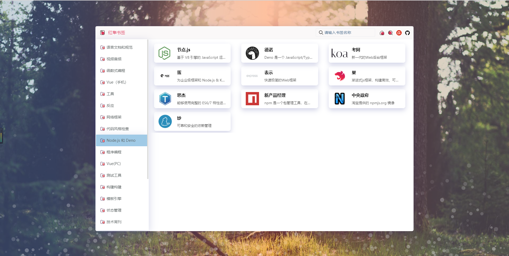
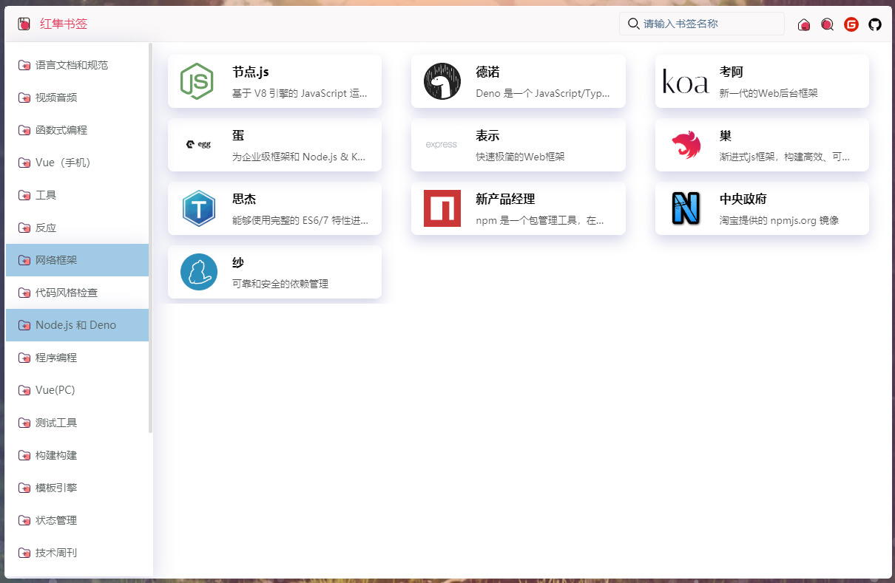

# kestrel-bookmark 红隼书签

#### 介绍
👉👉👉【红隼书签】一款简洁的在线书签导航网站。

同步印象中文的web导航数据；可以修改数据；全局搜索筛选功能；单页面完成逻辑非常简单，新手小白也能完成二次修改开发；采用granim插件完成背景动画；可选择更多动画效果；炫酷光晕背景动画效果。

## 网址书签
========
__注意：👉本项目会持续新增功能，但持续维护。如使用中发现问题，请留言或者提交 issue 。谢谢！！！__

## 安装步骤

* 1.克隆项目 https://gitee.com/zhanhongzhu/kestrel-bookmark.git
* 2.进入项目目录 `npm install`
* 3.启动项目`npm run serve`打开浏览器即可 localhost:8080
* 4.打包命令 `npm run build`

## 在线地址
[红隼书签](http://bookmark.zhanhongzhu.top/)

## 效果




#### 源码地址
完全开源，大家可以随意研究，二次开发。当然还是十分欢迎大家点个Star⭐⭐⭐  
👉👉[源码链接(gitee)](https://gitee.com/zhanhongzhu/kestrel-bookmark) &nbsp;&nbsp;&nbsp;&nbsp;&nbsp;&nbsp;👉👉[源码链接(github)](https://github.com/zhanhongzhu/kestrel-bookmark)

## 功能/特色（炫酷光晕背景动画效果）
* ✅ 1.同步印象中文的web导航数据；可以修改数据；</br>
* ✅ 2.全局搜索筛选功能；</br>
* ✅ 3.单页面完成逻辑非常简单，新手小白也能完成二次修改开发；</br>
* ✅ 4.采用granim插件完成背景动画；可选择更多动画效果；</br>
* ✅ 5.炫酷光晕背景动画效果</br>
```js
├── src 
     ├── assets      // 存放静态资源
     │    └──Json    // 静态数据源json数据
     │    └──svg    // 工具栏图标
     ├── APP.vue
     └── main.js
```
## 后续增加功能
* 👉本地离线数据持久化，书签增删改查</br>
* 👉serverless数据，书签增删改查</br>
* 👉背景图片自定义上传</br>
* 👉背景动画效果自定义</br>
* 👉工具栏功能自定义</br>
* 👉导入解析浏览器书签，同步书签数据</br>

  ## 其他链接
* [我的博客(收集各类大神的学习笔记及官方文档，强烈推荐)](https:/zhanhongzhu.top)</br>
* [红隼书签](http://bookmark.zhanhongzhu.top)</br>
* [掘金](https://juejin.im/user/5cc6757ce51d456e5238ca23)</br>
* [思否](https://segmentfault.com/u/huixiaodeyanjingzhenmei)</br>
* [CSDN](https://blog.csdn.net/weixin_43779957)</br>
* [简书](https://www.jianshu.com/u/b8d251f62b08)</br>
* [语雀(超过430多篇开发笔记)](https://www.yuque.com/zhanhongzhu)</br>
